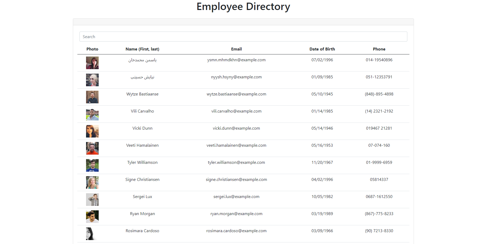

# Employee Directory

## Table of Contents

1. [Description](#Description)
2. [Criteria](#Criteria)
3. [Installation](#Installation)
4. [Usage](#Usage)
5. [Contributing](#Contributing)
6. [Issues](#Issues)
7. [Credits](#Credits)
8. [License](#License)
9. [Questions](#Questions)

## Description

We weren't given anything to go off of for this assignment except for the criteria, and honestly there wasn't much in the way of usable examples, either. I did a lot of digging around other people who had done the assignment in the past to see how they achieved it, and I used some code from another assignment and modified it to fit the bill.

I'll be honest, most of the code for sorting was yoinked from [JaredP17](https://github.com/JaredP17/employee-directory) on GitHub. He had a fantastic method and I mostly understand how it works, but I wouldn't have thought of it myself. I added notes to try to explain my understanding of the structure, and in order to study it for future reference and my own comprehension.

[Deployed website](https://mighty-employee-directory.herokuapp.com/)

Example picture:

## Criteria

Given a table of random users generated from the [Random User API](https://randomuser.me/), when the user loads the page, a table of employees should render. 

The user should be able to:

  * Sort the table by at least one category

  * Filter the users by at least one property.

## Installation

Files must be downloaded from Github. Then run npm install to get the necessary node modules. Lastly run npm start.

A ready version is also available at the [deployed website.](https://mighty-employee-directory.herokuapp.com/)

## Usage

This app pulls 50 random created users from the [Random User API](https://randomuser.me/) and places their non-sensitive information in a table. Users can sort each column by ascending or descending, or use the search bar to narrow down results.

## Contributing

For contributions, please create a fork to work on then, when done, create a Pull Request.

## Issues

Submit an Issue through Github for any bugs or problems.

## Credits

Assignment was developed as part of the SMU Coding Bootcamp.

## License

Copyright Ashley Wright 2021

This is covered under the <a href='https://opensource.org/licenses/ISC'>ISC</a> license.

## Questions

Feel free to contact through the following with any questions:

Email: ashleyaggie@aol.com

Github: <a href='https://github.com/ashleyaggie'>ashleyaggie</a>